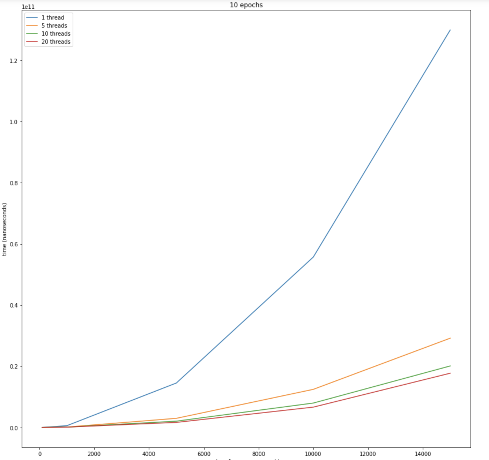

# Соколовский Вацлав, БПИ191
## Исследование времени работы мультипоточной Game of Life

В [данной папке](https://github.com/RinokuS/IISE-Homework/tree/main/HW2/Task_1) представлены исходники исследовательского проекта на языке C и python-скрипт для генерации графиков. Все графики также сохранены в формате .png в [SACompariso/Charts](https://github.com/RinokuS/IISE-Homework/tree/main/HW2/Task_1/Charts)

## Цель работы
Экспериментальное определение разницы времени работы мультипоточной игры Game of Life с разным количеством потоков и сравнительный анализ полученных результатов.

## Функционал
Для удобства выполнения и повторения эксперимента были реализованы:
1. Функция рандомной генерации игрового поля заданного размера (сид генерации указывается в коде программы)
2. Скрипт для генерации графиков с помощью pandas и matplotlib ([charts.ipynb](https://github.com/RinokuS/IISE-Homework/tree/main/HW2/Task_1/charts.ipynb))

## Отчет
Результатом проведения исследовательской работы является график с 4 кривыми, обозначающими количество потоков программы (1, 5, 10 и 20 соответственно).

По графикам мы хорошо можем видеть, как растет отставание однопоточной программы по сравнению в многопоточными при повышении размерности игрового поля. Связано это, очевидно, с реализацией многопоточности в приложении: каждый поток отвечает за свои строчки таблицы, и, чем больше размер игрового поля, тем большая часть работы будет распараллелена до упирания в барьер.

P.S. Интересное дополнительное наблюдение:  
На малых размерах игрового поля (100х100), если смотреть на данные, мы можем увидеть, что добавление количество потоков не уменьшает, а увеличивает время работы программы. На графиках этого не видно, к сожалению, из-за размерностей данных.  
Скорее всего, это связано с тем, что каждый отдельный поток получает настолько мало работы, что эффективное распараллеленое время выходит максимально незначительным по сравнению с временем обработки потоков в барьере.

