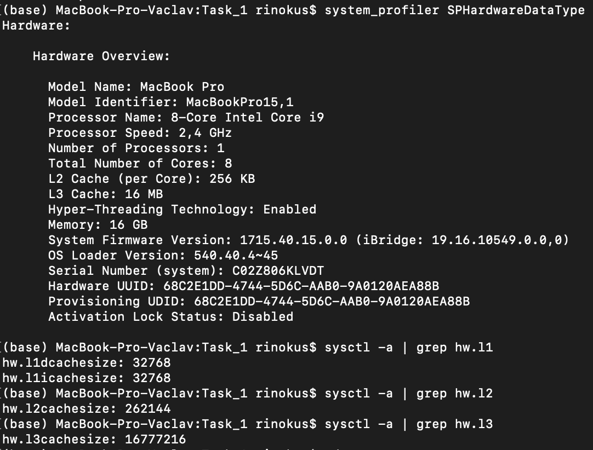
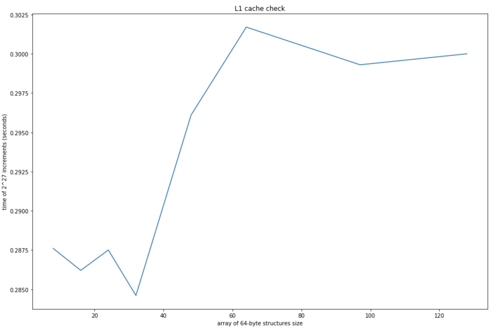
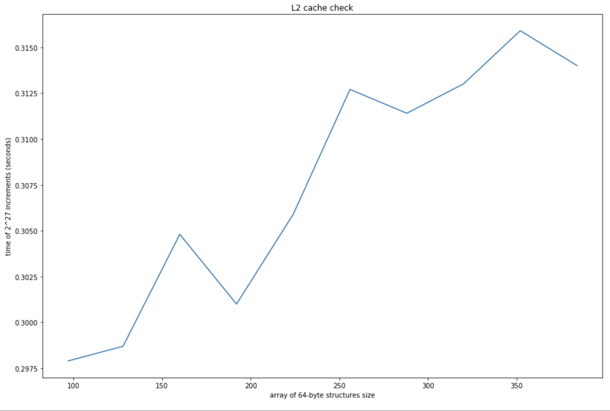

# Соколовский Вацлав, БПИ191
## Экспериментальное выяснение размера L1 и L2 кэшей

В [данной папке](https://github.com/RinokuS/IISE-Homework/tree/main/HW2/Task_2) представлены исходники исследовательского проекта на языке C и python-скрипт для генерации графиков. Все графики также сохранены в формате .png в [SACompariso/Charts](https://github.com/RinokuS/IISE-Homework/tree/main/HW2/Task_2/Charts)

## Цель работы
Экспериментальное определение размеров L1 и L2 кэшей с помощью программы на языке С.

## Функционал
Для удобства выполнения и повторения эксперимента были реализованы:
1. Сама функция подсчета времени выполнения 2^7 инкрементов для n 64-байтных элементов массива
2. Скрипт для генерации графиков с помощью pandas и matplotlib ([charts.ipynb](https://github.com/RinokuS/IISE-Homework/tree/main/HW2/Task_2/charts.ipynb))

## Отчет
Результатом проведения исследовательской работы являются 2 графика, обозначающие время доступа к окрестности L1 кэша и L2 кэша соответственно, а также скриншот настоящих характеристик процессора, на котором проводилось тестирование.

Выводом системных характеристик были распознаны следующие размеры кэшей на машине:
* L1-cache: 32 KB
* L2-cache: 256 KB




Для тестирования окрестности L1-кэша были выбраны следующие размерности (в KB): ```8, 16, 24, 32, 48, 64, 97, 128```
<br>
На графике мы можем заметить умеренные колебания из-за погрешности вычислений, но их тяжело спутать с прыжком времени доступа после пересечения значения в ```32 KB```, равному размерности нашего L1-кэша. На графике отчетливо виден как сам скачок, так и сохранение состояния при дальнейшем увеличении размера буфера.



Для тестирования окрестности L2-кэша были выбраны следующие размерности (в KB): ```97, 128, 160, 192, 224, 256, 288, 320, 352, 384```
<br>
Абсолютно идентично графику для L1, на данном графике мы можем заметить умеренные колебания из-за погрешности вычислений и также сильное увеличение времени доступа после пересечения значения в ```256 KB```, равному размерности нашего L2-кэша. На графике отчетливо виден как сам скачок, так и сохранение состояния при дальнейшем увеличении размера буфера.


